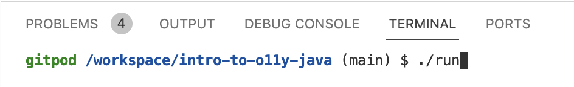
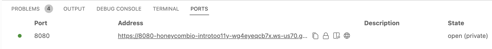

# Intro to Observability: OpenTelemetry in Java

This Spring Boot application is here for you to try out tracing with Honeycomb.
It consists of a microservice that calls itself, so you can simulate a whole microservice ecosystem with just one service!

## What to Do

There are two main options to run this example and view traces in Honeycomb, by either quickly running the app in a cloud environment with Gitpod or running it locally on your machine.

### Running in Gitpod (recommended)

[](https://gitpod.io/#https://github.com/honeycombio/intro-to-o11y-java)

Gitpod is a free cloud environment where you can run the example without needing to clone the code or install Maven and Java on your machine.

#### Configure tracing: Connect to Honeycomb

First, you'll configure the app to publish traces to Honeycomb.

For that, you need to get your Honeycomb API key and set it as an environment variable.

[Log in to honeycomb](ui.honeycomb.io) and [get a Honeycomb API Key](https://docs.honeycomb.io/getting-data-in/api-keys/#find-api-keys).

Now open the `.env` file and populate your Honeycomb API key environment variable. This `.env` file will be ignored by git, so you won't commit your API key.

```
export HONEYCOMB_API_KEY=<your-honeycomb-api-key-goes-here>
```

#### Start the app

Now that you've configured the Honeycomb API key, you're ready to start the app!

To start the app in Gitpod, run `./run` in the Gitpod terminal:



Once the app starts up and you see log output similar to the output below, then the app is ready to use:

```
2022-10-12 15:17:20.970  INFO 2315 --- [           main] o.s.b.w.embedded.tomcat.TomcatWebServer  : Tomcat started on port(s): 8080 (http) with context path ''
2022-10-12 15:17:20.979  INFO 2315 --- [           main] i.h.otel.fibonacci.FibonacciApplication  : Started FibonacciApplication in 1.685 seconds (JVM running for 3.326)
```

#### See the App

After the app starts up, click the "Ports" tab and click the http address to open your app in a new tab:



Then in the app - activate the sequence of numbers by pushing **Go**. After you see numbers, push **Stop**. Try this a few times.

#### Stop the App

Push `Ctrl-C` in the terminal where the app is running to stop it.

#### View traces in Honeycomb

Now your traces will be available to view in Honeycomb.

Go to [Honeycomb](https://ui.honeycomb.io). To choose a dataset, use the OTEL_SERVICE_NAME you configured. (The default is 'sequence-of-numbers').

Do you see data in the graphs? Success!

### Running locally

If you'd prefer to run the app locally, start by cloning this repository. You will also need to have Java 11+ and Maven installed locally.

If you use [VSCode devcontainers](https://code.visualstudio.com/docs/remote/containers-tutorial), this repository is configured to be opened in a container.

#### Configure Tracing: Connect to Honeycomb

For that, you need to get your Honeycomb API key and set it as an environment variable.

[Log in to honeycomb](ui.honeycomb.io) and [get a Honeycomb API Key](https://docs.honeycomb.io/getting-data-in/api-keys/#find-api-keys).

##### .env file (Recommended)

Let's put the API key environment variable in a file (and then not commit it).

Copy the example env file to get started:

`cp .env.example .env`

Now open `.env`, and populate your Honeycomb API key environment variable (This file will be ignored by git, so you won't commit your API key.)

```
export HONEYCOMB_API_KEY=<your-honeycomb-api-key-goes-here>
```

##### Command line

Or you can set the variables at the command line before running the app.
(These will be overridden by .env if it exists.)

```
export HONEYCOMB_API_KEY=<your Honeycomb API key here>
export OTEL_SERVICE_NAME=sequence-of-numbers

./run
```

#### Start the App

Now you can start the app! To do that, run the following Maven command:

`mvn spring-boot:run`

or with the script:

`./run`

#### See the App

The app is running on your local machine at [http://localhost:8080](http://localhost:8080)

Activate the sequence of numbers by pushing **Go**. After you see numbers, push **Stop**. Repeat this a few times.

#### Stop the App

Push `Ctrl-C` in the terminal where the app is running to stop it.

#### See the Results

Go to [Honeycomb](https://ui.honeycomb.io). To choose a dataset, use the OTEL_SERVICE_NAME you configured. (The default is 'sequence-of-numbers').

Do you see data in the graphs? Success!

## Part 3 of the workshop: Customize a Span

Let's make it easier to see what the "index" query parameter is.

To do this, change the code using the OpenTelemetry API.

### Use the API in Your Code

In the `FibonacciController.java` file within the `getFibonacciNumber` method, add the index parameter to the current Span:

```java
import io.opentelemetry.api.trace.Span;

  Span span = Span.current();
  span.setAttribute("parameter.index", i);
```

Restart the app, make the sequence go, and find that field on the new spans.

Can you make the trace waterfall view show the index?
What pattern does it show?

## Advanced: Create a Custom Span

Make the calculation into its own span, to see how much of the time spent on this service is the meat: adding the fibonacci numbers.

Break out a method for creating the returned Fibonacci number, and add the magical `@WithSpan` attribute.

Something like:

```java
import io.opentelemetry.extension.annotations.WithSpan;

  @WithSpan
  private FibonacciNumber calculate(int index, FibonacciNumber previous, FibonacciNumber oneBeforeThat) {
    return new FibonacciNumber(index, previous.fibonacciNumber + oneBeforeThat.fibonacciNumber);
  }
```

After a restart, do your traces show this extra span? Do you see the name of your method?
What percentage of the service time is spend in it?

## Appendix: How to Add Auto-instrumentation to Your Own App

This magic happens through [instrumentation](https://docs.oracle.com/en/java/javase/11/docs/api/java.instrument/java/lang/instrument/Instrumentation.html) by a Java agent.
The agent gloms onto your Java app, recognizes Spring receiving HTTP requests, and emits events.

There's a general OpenTelemetry Java agent, and [Honeycomb wraps it into a version](https://github.com/honeycombio/honeycomb-opentelemetry-java#agent-usage) that's easier to configure. This app uses that one.

Find details (and the latest) in [Honeycomb's docs](https://docs.honeycomb.io/getting-data-in/java/opentelemetry-distro/).

### Get the Agent

This is a jar that runs alongside your program, and injects bytecode for tracing.

Download the Honeycomb OpenTelemetry Java agent into your project directory from [this direct download link](https://github.com/honeycombio/honeycomb-opentelemetry-java/releases/download/v1.3.0/honeycomb-opentelemetry-javaagent-1.3.0.jar) or from the [releases page](https://github.com/honeycombio/honeycomb-opentelemetry-java/releases).

or from a linux command line (including the devcontainer): `wget https://github.com/honeycombio/honeycomb-opentelemetry-java/releases/download/v1.3.0/honeycomb-opentelemetry-javaagent-1.3.0.jar`

### Attach the Agent

The goal is to add a JVM argument: `-javaagent:honeycomb-opentelemetry-javaagent-1.3.0.jar`

To add this to `mvn spring-boot:run`, open `pom.xml`, find the `plugin` block for `spring-boot-maven-plugin`, and add a `configuration` block like the one here:

```xml
 <plugin>
    <groupId>org.springframework.boot</groupId>
    <artifactId>spring-boot-maven-plugin</artifactId>
    <configuration>
        <agents>
            <agent>
                honeycomb-opentelemetry-javaagent-1.3.0.jar
            </agent>
        </agents>
    </configuration>
</plugin>
```

### Bring in the OpenTelemetry API for Custom Tracing

Add these dependencies to `pom.xml`:

```xml
    <dependency>
        <groupId>io.opentelemetry</groupId>
        <artifactId>opentelemetry-api</artifactId>
        <version>1.14.0</version>
    </dependency>
    <dependency>
        <groupId>io.opentelemetry</groupId>
        <artifactId>opentelemetry-extension-annotations</artifactId>
        <version>1.14.0</version>
    </dependency>
```

## Updating this Repo

### Honeycomb Distro

Check the version of the agent in the [Releases](https://github.com/honeycombio/honeycomb-opentelemetry-java/releases) page of Honeycomb OpenTelemetry Distribution for Java.
Compare to the jar in the root of this repo.

If out of date:

- update the version in this file (many times, including the next line)
- download the new one: `wget https://github.com/honeycombio/honeycomb-opentelemetry-java/releases/download/v1.3.0/honeycomb-opentelemetry-javaagent-1.3.0.jar`
- delete the old one
- update the version in the `agent` section of `pom.xml`

### OTel Libraries

Check the [README](https://github.com/honeycombio/honeycomb-opentelemetry-java/blob/main/README.md) of the Honeycomb distro for the current version of OTel.

Make the `io.opentelemetry` dependencies in `pom.xml` match that.
Test the app.

## FAQ

**How do I open this project in IntelliJ IDEA?**

First, clone the repo locally - if you haven't already.

Then createa a new project in Intellij from the File -> New -> Project from existing sources menu option. Then select the Maven `pom.xml` file from your local copy of this project and IntelliJ will create and set up the project for you.
